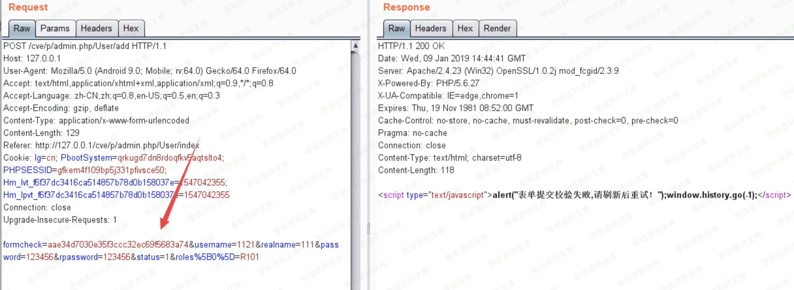
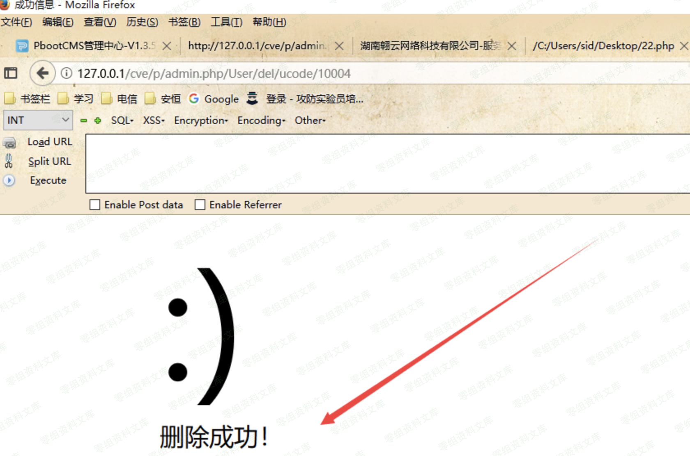

PbootCMS csrf
=============

一、漏洞简介
------------

二、漏洞影响
------------

三、复现过程
------------

我将网站建立在本地，本来想测试添加用户的操作，但是发现这里有formcheck验证，所以失败了

然后我想到了删除用户位置，首先我使用管理员账号登陆，在删除用户的操作时抓包。发现很简单。只有一个id来判断删除哪个用户

于是我直接构造一个新的url，[http://127.0.0.1/cve/p/admin.php/User/del/ucode/10004（上面是10003）](http://127.0.0.1/cve/p/admin.php/User/del/ucode/10004（上面是10003）)

确认这个用户是存在的。然后访问<http://127.0.0.1/cve/p/admin.php/User/del/ucode/10004>

删除成功

但是这样很容易被熟悉的管理员识别，我们可以利用段网站来进行攻击。

短网址生成网站<https://www.ft12.com/>

<http://127.0.0.1/cve/p/admin.php/User/del/ucode/10004>

可以缩短为<http://u6.gg/gPCcN>

访问这个短网址，也可以变为[http://127.0.0.1/cve/p/admin.php/User/del/ucode/10004触发漏洞](http://127.0.0.1/cve/p/admin.php/User/del/ucode/10004触发漏洞)

image
