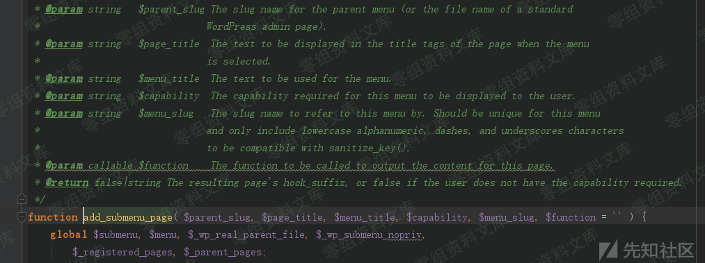
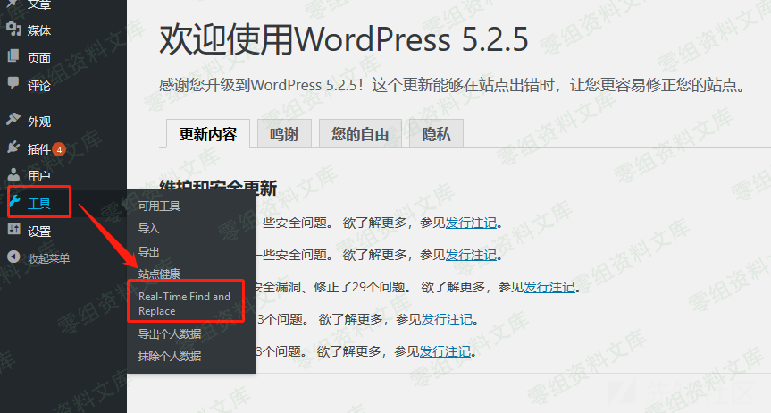
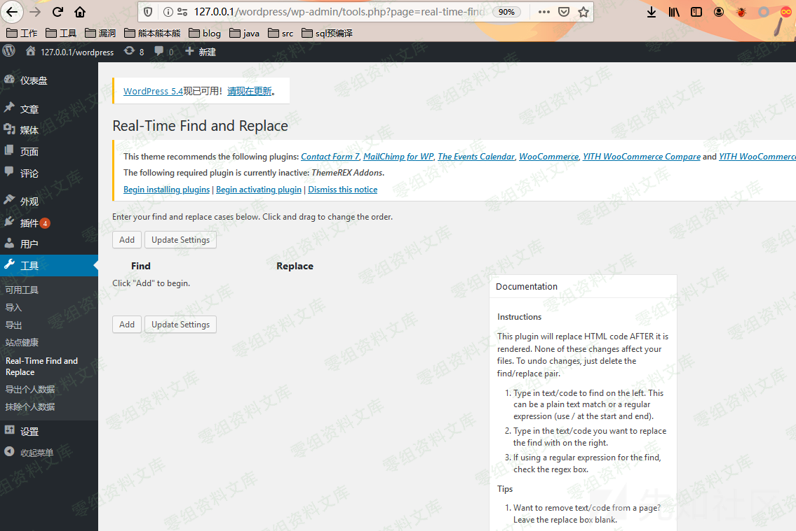
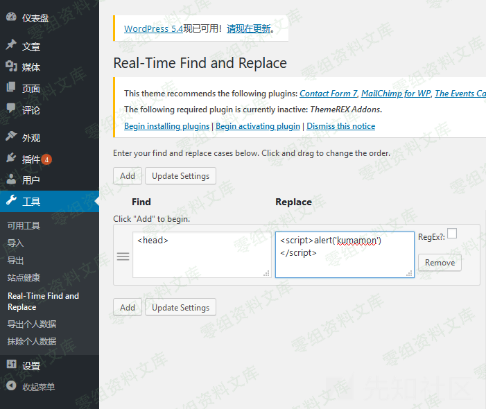

WordPress Plugin - Real-Time Find and Replace xss漏洞
=====================================================

一、漏洞简介
------------

二、漏洞影响
------------

三、复现过程
------------

### 漏洞分析

这一部分是对本次漏洞分析过程中涉及到的WordPress一些函数与机制的介绍，如果对WordPress很了解可以直接跳过

#### Real-Time Find and Replace插件是如何注册的

首先分析下Real-Time Find and
Replace插件是如何注册到wordpress的菜单栏中的，以及WordPress是如何调用该插件

real-time-find-and-replace插件代码很少，只有一个php文件real-time-find-and-replace.php

首先看wp-content\\plugins\\real-time-find-and-replace\\real-time-find-and-replace.php
17行处的far\_add\_pages方法，该方法中使用add\_submenu\_page方法对wordpress的顶级菜单添加子菜单

add\_submenu\_page方法的参数说明如下

parent\_slug- 父菜单的子名称（或标准WordPress管理页面的文件名）page\_title- 选择菜单后在页面标题标签中显示的文本menu\_title- 菜单中使用的文本capability- 向用户显示此菜单所需的功能menu\_slug- 别名，用于引用此菜单function- 用于输出此页面内容的函数

这里重点看下parent\_slug参数和function参数

parent\_slug参数值为tools.php 因此这里是在工具菜单栏处添加此子菜单

从后台页面显示结果来看，的确如此

除此之外，通过parent\_slug参数，可以在如下不同位置添加子菜单

    1、在仪表盘菜单处: add_submenu_page( ‘index.php’, … );
    2、在文章菜单处: add_submenu_page( ‘edit.php’, … );
    3、在媒体菜单处: add_submenu_page( ‘upload.php’, … );
    4、在链接菜单处: add_submenu_page( ‘link-manager.php’, … );
    5、在页面菜单处: add_submenu_page( ‘edit.php?post_type=page’, … );
    6、在评论菜单处: add_submenu_page( ‘edit-comments.php’, … );
    7、在自定义文章类型菜单处: add_submenu_page(‘edit.php?post_type=your_post_type’,…)
    8、在外观菜单处: add_submenu_page( ‘themes.php’, … );
    9、在插件菜单处: add_submenu_page( ‘plugins.php’, … );
    10、在用户菜单处: add_submenu_page( ‘users.php’, … );
    11、在工具菜单处: add_submenu_page( ‘tools.php’, … );
    12、在设置菜单处: add_submenu_page( ‘options-general.php’, … );

接着来看add\_submenu\_page方法的function参数：

function参数指定用于输出此页面内容的函数。这里指定的是far\_options\_page，也就是要用far\_options\_page来输出页面信息

关于add\_submenu\_page方法需要了解的就这么多，继续往下看

可见19行有一处add\_action( "admin\_print\_scripts-\$page",
'far\_admin\_scripts');代码接下来介绍下add\_action的首参，admin\_print\_scripts-\$page是什么\$page是add\_submenu\_page方法的返回值，add\_submenu\_page方法在添加子菜单成功后，会将子菜单的对应页面的page\_hook作为返回值返回

这里的\$page值为tools\_page\_real-time-find-and-replace。使用add\_submenu\_page方法注册的子菜单page\_hook都是唯一的，程序也是通过这个值来区分我们注册的不同页面

如果想理解admin\_print\_scripts-(page\_hook)，不妨先看看和它很相似的admin\_print\_script方法：

admin\_print\_scripts方法用来给WordPress后台页面引入js与css文件。使用这个钩子会在所有WordPress后台页面中引入js与css文件。

实际操作中往往不需要在WordPress后台所有页面中加载同一组js与css文件，而是在指定页面中引入指定的js或css文件，这里就需要使用admin\_print\_scripts-(page\_hook)方法。

admin\_print\_scripts-(page\_hook)方法中的page\_hook部分指定了需要加载js或css文件的页面。在这个插件代码中，通过add\_action("admin\_print\_scripts-\$page",
'far\_admin\_scripts');在admin\_print\_scripts-tools\_page\_real-time-find-and-replace页面中加载far\_admin\_scripts函数，而far\_admin\_scripts函数中指定了要引入的js与css文件，见下图

引入的这些js与css文件，将在add\_submenu\_page方法function参数渲染生成页面时生效。

在弄清楚插件是如何注册后，通过访问工具菜单栏中的real-time-find-and-replace子菜单，即可进入存在漏洞的页面，该页面即为far\_options\_page函数加载far\_admin\_scripts函数中引入的js与css文件后所渲染的结果

#### Real-Time Find and Replace插件是如何工作的

这一部分比较有意思。在看代码之前，通过Real-Time Find and
Replace插件的介绍来看，这个插件可以实时查找和替换网站页面中的数据。但这一点是如何做到的呢？我一度以为这个插件可以遍历读取所有的页面文件，对文件内容直接进行搜索与替换，但这样实现未免太繁琐了。

跟踪代码可以发现，实际的实现很巧妙。wp-content\\plugins\\real-time-find-and-replace\\real-time-find-and-replace.php中可看到下列代码

在real-time-find-and-replace.php文件代码的最后一行，通过add\_action将far\_template\_redirect函数连接到template\_redirect钩子上。template\_redirect钩子将会在显示所请求页面的模板文件前执行，以便插件改写对模板文件的选择。

接着看下far\_template\_redirect函数

far\_template\_redirect中使用ob\_start函数打开输出缓冲区，将所请求页面的模板文件信息保存在输出缓冲区中,并使用far\_ob\_call函数处理输出结果。

far\_ob\_call函数对所请求页面的模板文件内容进行搜索与替换

因此最终输出的页面中内容被修改，但是页面文件自身并不会被修改

### 漏洞复现

本次漏洞就出在了real-time-find-and-replace插件管理页面，该页面提供了wordpress页面全局搜索与替换的功能

执行完毕之后，wordpress中所有
